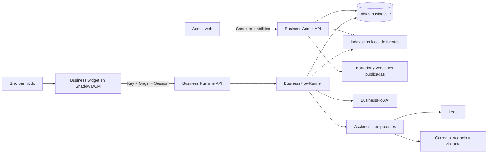
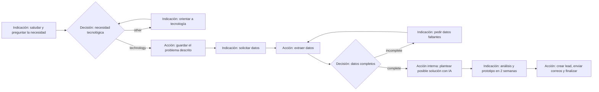

# Business: chatbot guiado, leads y widget

## Objetivo

Business permite que un administrador cree chatbots que siguen un flow explícito. El motor no decide libremente qué acción ejecutar: solo avanza por bloques publicados de indicación, decisión y acción. Cada conversación queda fijada a una versión del flow, registra su consumo y puede terminar creando un lead y enviando notificaciones.

El módulo está protegido por dos condiciones simultáneas:

1. El feature flag global `business` debe estar activo en **Nuevas funcionalidades**.
2. El usuario administrativo debe tener rol `admin` y la ability requerida por el endpoint.

Los perfiles y usuarios normales no reciben abilities de Business.

## Arquitectura



### Capas del backend

- `app/Http/Controllers/api/v1/Business*`: endpoints administrativos.
- `PublicBusinessChatController`: contrato público del chatbot.
- `AuthenticateBusinessClient`: valida feature, estado, key, expiración y origen exacto; también genera CORS dinámico.
- `BusinessFlowService`: inicializa, guarda, valida y publica versiones.
- `BusinessFlowValidator`: verifica un único inicio, tipos válidos, salidas, ramas y nodos alcanzables.
- `BusinessFlowRunner`: ejecuta el grafo, limita pasos y fija cada conversación a una versión publicada.
- `BusinessFlowAI`: interfaz desacoplada para clasificación, extracción y análisis. El driver local `LocalBusinessFlowAI` permite pruebas deterministas sin servicios externos.
- `BusinessKnowledgeRetriever`: recuperación lexical local sobre chunks indexados.
- `BusinessLeadService`: crea el lead y ejecuta notificaciones idempotentes.
- `BusinessUsageRecorder`: registra tokens de fuentes, mensajes, recuperación, decisiones, extracción y análisis.

## Modelo de datos

Todas las tablas son propias del módulo:

| Tabla | Responsabilidad |
| --- | --- |
| `businesses` | Identidad y estado `draft`, `active` o `paused`. |
| `business_settings` | Correos, locale y apariencia del widget. |
| `business_api_clients` | Key pública almacenada únicamente como SHA-256, expiración y uso. |
| `business_api_client_origins` | Orígenes HTTP/HTTPS exactos permitidos. |
| `business_sources` | Archivo/texto extraído y estado de indexación. |
| `business_knowledge_chunks` | Fragmentos recuperables de las fuentes. |
| `business_flows` | Punteros al borrador y a la versión publicada. |
| `business_flow_versions` | Versiones inmutables publicadas y borrador editable. |
| `business_flow_nodes` | Bloques, posiciones y configuración. |
| `business_flow_edges` | Flechas, rama y destino. |
| `business_conversations` | Estado, versión fijada, nodo actual y contexto. |
| `business_messages` | Mensajes del visitante/asistente con tokens. |
| `business_node_executions` | Auditoría de cada bloque ejecutado. |
| `business_leads` | Nombre, email, teléfono, WhatsApp, empresa/sitio opcionales, problema y análisis interno de posible solución. |
| `business_lead_status_histories` | Creación y cambios de estado del lead, usuario responsable y observaciones. |
| `business_usage_events` | Consumo granular por tipo de evento. |
| `business_action_runs` | Idempotencia, intentos y errores de acciones. |

## Interfaz administrativa

Cuando el toggle está activo, el menú **Business** aparece inmediatamente después de **Perfiles** solo para administradores.

### Listado

Muestra nombre, estado y última actualización. **Agregar** solicita nombre y descripción y crea automáticamente el flow de ejemplo como borrador.

### Submenú

- **General**: edita nombre y descripción.
- **Fuentes**: conserva el mismo patrón visual de Perfiles. El alta abre un modal para cargar PDF, TXT, Markdown, CSV, JSON o texto pegado; la tabla permite descargar fuentes con archivo y exige confirmación antes de eliminar una fuente y sus chunks.
- **Flow**: canvas gráfico editable.
- **Leads**: tabla compacta con contacto, empresa, estado, creación y actualización. Filtra por rango sobre la fecha de creación o actualización y por varios estados (`created`, `contacted`, `sale`, `no_response`, `closed`). Al abrir un lead, el modal separa toda la información y el historial desde la creación; cada cambio de estado exige confirmación y admite observaciones.
- **Uso**: tokens, fuentes, mensajes, conversaciones, leads, conversaciones sin lead y desglose de eventos. Incluye rango `Desde`/`Hasta`, carga por defecto el último mes calendario y conserva el rango en la URL.
- **Configuración**: se organiza en las pestañas **Correo**, **Widget** y **API**. Correo contiene receptor/remitente, Widget contiene apariencia y activación, y API administra keys y orígenes.
- **Docs**: documentación integrada del runtime.

El botón superior **Activar business** publica el chatbot para el runtime. La activación exige una versión válida publicada; pausar bloquea nuevas llamadas públicas.

El menú lateral, su estado seleccionado, colores, iconos, ancho, separación, comportamiento sticky y selector móvil reutilizan la organización visual de las secciones de Perfil. Los títulos de página usan `h4` y texto descriptivo como Configuración e Insights de Perfil.

## Editor del flow

El canvas usa HTML, pointer events y SVG, sin una dependencia remota. Se puede navegar horizontal y verticalmente arrastrando con el mouse cualquier zona vacía del fondo; durante el paneo el cursor cambia de mano abierta a mano cerrada. Las barras de scroll nativas continúan disponibles. El gesto no se activa al presionar un nodo, de modo que el drag de bloques conserva su comportamiento independiente. El plano se recalcula y expande en las cuatro direcciones cuando un bloque se mueve, incluyendo coordenadas negativas, por lo que no existe un límite funcional fijo de navegación.

Cada bloque tiene:

- identificador estable;
- tipo `instruction`, `decision` o `action`;
- título;
- posición X/Y;
- configuración JSON tipada por el runtime.

Las flechas guardan bloque origen, destino, etiqueta y `source_handle`. En decisiones, `source_handle` identifica la rama. El inspector permite editar mensajes, espera de input, modo de decisión, ramas, acción, nodo inicial, conexiones y eliminación.

### Flow inicial



La publicación valida todo el grafo y crea automáticamente un nuevo borrador basado en la versión publicada. Las conversaciones que ya comenzaron continúan sobre la versión anterior.

El flow inicial contiene 11 nodos y 12 flechas. Solo permite finalizar cuando existen todos estos valores válidos:

- problema del cliente de al menos 20 caracteres;
- nombre y apellido;
- email válido;
- teléfono en formato internacional con `+` e indicativo de país;
- WhatsApp en formato internacional con `+` e indicativo de país;
- posible solución interna ya generada por la IA.

Empresa y sitio web son opcionales. La acción `analyze_solution` está marcada como interna: guarda el análisis en el contexto y en el lead, pero no produce un mensaje visible para el visitante.

## Seguridad del runtime

1. Al crear una key se devuelve el valor `biz_pk_...` una sola vez.
2. La base de datos conserva solo `hash('sha256', key)` y un prefijo identificable.
3. Cada key exige al menos un origen HTTP/HTTPS exacto, por ejemplo `http://localhost:3001`.
4. El middleware exige `Origin` y responde CORS únicamente si ese origen está permitido.
5. El inicio devuelve una session cifrada ligada a negocio, cliente, conversación, origen y expiración.
6. Mensajes y status exigen la session en `X-Bigmelo-Business-Session`.
7. `Idempotency-Key` evita guardar dos veces el mismo mensaje del visitante.
8. Las acciones finales tienen una clave de idempotencia por conversación, nodo y operación.

## Runtime API

Base local por defecto: `http://localhost:8000`.

Headers de todas las llamadas:

```http
Origin: http://localhost:3001
X-Bigmelo-Business-Key: biz_pk_...
Accept: application/json
Content-Type: application/json
```

### Configuración pública del widget

```http
GET /api/business/widget
```

Devuelve título, botón, color, posición, locale y nombre del negocio. Devuelve 404 si el widget no está activo.

### Iniciar conversación

```http
POST /api/business/conversations

{"visitor_id":"visitor-123"}
```

Respuesta relevante:

```json
{
  "data": {
    "conversation_id": "uuid",
    "status": "in_progress",
    "session": "encrypted-token",
    "messages": [
      {
        "role": "assistant",
        "content": "¡Hola! Cuéntanos qué problema quieres resolver.",
        "required_fields": ["project_summary"]
      }
    ]
  }
}
```

El integrador debe conservar `conversation_id` y `session`. `data.messages` contiene las indicaciones iniciales del asistente generadas al arrancar el flow. Cuando una indicación espera campos concretos, el mensaje incluye `required_fields` con los identificadores todavía pendientes. Puede incluir también `optional_fields`: esos controles deben mostrarse, pero no deben impedir el envío ni la finalización si quedan vacíos.

### Enviar mensaje

```http
POST /api/business/conversations/{conversation_id}/messages
X-Bigmelo-Business-Session: encrypted-token
Idempotency-Key: request-uuid

{"message":"Necesito automatizar un proceso con IA"}
```

La respuesta incluye únicamente los mensajes del asistente producidos durante ese avance. No contiene el historial completo y el arreglo puede traer uno o varios elementos:

```json
{
  "message": "Business message processed successfully.",
  "data": {
    "conversation_id": "550e8400-e29b-41d4-a716-446655440000",
    "status": "in_progress",
    "finished": false,
    "messages": [
      {
        "id": 104,
        "role": "assistant",
        "content": "Entiendo el problema que quieres resolver.",
        "created_at": "2026-08-20T15:32:01.000000Z"
      },
      {
        "id": 105,
        "role": "assistant",
        "content": "Para continuar, indícanos tus datos de contacto.",
        "created_at": "2026-08-20T15:32:01.000000Z",
        "required_fields": ["full_name", "email", "phone", "whatsapp"],
        "optional_fields": ["company", "website"]
      }
    ]
  }
}
```

La interfaz cliente agrega esos elementos al chat en el orden recibido y conserva localmente los mensajes anteriores. `required_fields` y `optional_fields` aparecen dentro del mensaje que solicita los datos, no a nivel de `data`. Los primeros son obligatorios y, para una indicación dinámica de datos faltantes, contienen solamente lo aún incompleto; los segundos se muestran y se envían solo cuando el visitante los completa. El integrador debe dejar de pedir input cuando `finished` sea `true` o el estado deje de ser `in_progress`.

Una secuencia típica contiene varias llamadas al mismo endpoint:

1. `{"message":"Soy Laura Gómez."}` devuelve la indicación para describir el problema.
2. `{"message":"Procesamos facturas manualmente y queremos extraer los datos con IA."}` devuelve la solicitud de contacto.
3. Una respuesta con datos incompletos devuelve exactamente los campos faltantes.
4. Al completar los datos devuelve `status: "completed"`, `finished: true` y el mensaje final del asistente.

La posible solución generada por IA es interna: se guarda en el lead y se envía al negocio, pero nunca aparece en `data.messages` para el visitante.

### Consultar estado

```http
GET /api/business/conversations/{conversation_id}/status
X-Bigmelo-Business-Session: encrypted-token
```

Estados: `in_progress`, `completed`, `abandoned` y `failed`.

El response de status incluye `current_node`, `started_at` y `completed_at`. No contiene `messages` y no permite recuperar el historial completo.

## Widget incluido

El build web genera `widget/business-v1.js`. El snippet se muestra en Configuración inmediatamente después de crear una key:

```html
<script
  src="http://localhost:3001/widget/business-v1.js"
  data-bigmelo-business="biz_pk_..."
  data-bigmelo-api="http://localhost:8000"
></script>
```

El widget:

- usa Shadow DOM;
- no modifica CSS del sitio anfitrión;
- respeta color, título, texto y posición configurados;
- es responsive y accesible por teclado;
- conserva un visitor ID local sin guardar la key;
- maneja session, idempotencia, errores y finalización;
- al finalizar oculta el compositor y muestra un estado explícito de conversación finalizada;
- se sirve como script clásico tanto en desarrollo como en el build de producción.

## Correos y leads

`analyze_solution` genera primero el análisis interno y `finalize_lead` crea el lead únicamente si el problema, el análisis y todos los datos obligatorios son válidos. Si están configurados:

- `lead_recipient_email` recibe nombre, email, teléfono, WhatsApp, empresa, sitio web, problema y posible solución planteada por la IA;
- el email extraído del visitante recibe confirmación;
- `sender_email`, `sender_name` y `reply_to_email` se aplican a ambos correos.

La posible solución nunca se incluye en la conversación ni en el correo de confirmación enviado al visitante.

Las notificaciones usan la cola de Laravel. En desarrollo local debe existir un worker para procesarlas.

## Pruebas

### Matriz funcional del flow publicado

| Escenario | Entrada representativa | Respuesta o resultado esperado |
| --- | --- | --- |
| Nombre | `Peter Parker` | Solicitar `project_summary`. |
| Necesidad tecnológica demasiado breve | `Quiero un chatbot` | Pedir de inmediato situación/proceso, usuarios y resultado esperado; no solicitar todavía contacto. |
| Chatbot suficientemente descrito | `Necesito un chatbot para recibir pedidos, consultar inventario y derivar conversaciones` | Solicitar Email, Teléfono y WhatsApp; mostrar Empresa y Sitio web como opcionales si el nombre ya fue capturado. |
| Software, IA, datos o cloud suficientemente descritos | Descripción concreta del proceso y resultado | Avanzar a contacto con `required_fields` y `optional_fields`. |
| Solicitud no tecnológica | `Quiero organizar una fiesta` | Explicar el alcance tecnológico y permitir que el visitante reformule. |
| Recuperación después de una solicitud no tecnológica | Una nueva descripción tecnológica | Retomar el flow, guardar esa descripción y solicitar contacto. |
| Contacto parcial por API | Faltan uno o más obligatorios | Responder solamente con los `required_fields` pendientes; mostrar recordatorio de indicativo únicamente si falta teléfono o WhatsApp. |
| Empresa y sitio web vacíos | Todos los obligatorios válidos | Finalizar y crear el lead con ambos opcionales en `null`. |
| Empresa y sitio web diligenciados | Todos los obligatorios y opcionales | Finalizar y guardar ambos valores en el lead. |
| Solución interna para chatbot | Problema menciona chatbot y datos de contacto | Priorizar una solución de asistente conversacional; no confundirla con un proyecto de arquitectura de datos. |

La posible solución permanece interna en todos los escenarios: se almacena en el lead y se incluye en la notificación al negocio, pero no se devuelve al visitante.

- Unitarias: validador del grafo, extracción/normalización de teléfono y WhatsApp, separación entre problema y datos de contacto, y heurísticas deterministas del driver local.
- Feature API: feature toggle, rol, listado, creación, Fuentes, descarga/eliminación de archivos, aislamiento de fuentes entre negocios, publicación, activación, hash de keys, CORS exacto, origen bloqueado, conversación incompleta/completa, lead, solución interna, correos, status, rango de Uso y validación de fechas.
- Build: TypeScript, ESLint, Vite admin y Vite web.
- Funcionales/visuales: editor real con 11 bloques y 12 flechas, inspector sincronizado con el nodo inicial, publicación, canvas navegable en ambos ejes, configuración, fuente, activación, widget real, rama no tecnológica, datos faltantes, finalización, Leads, cambio de estado, Uso y Docs.

### Ciclos de QA local ejecutados

1. Reproducción de `Failed to fetch`; corrección de CORS para que `/api/businesses` conserve la política del API administrativo.
2. Creación del negocio de software/IA/datos/cloud y ampliación del modelo para teléfono, WhatsApp y sitio web.
3. Validación visual del editor, selección coherente del nodo inicial y publicación de la versión 1.
4. Configuración de correos/widget/orígenes, fuente indexada, corrección de la etiqueta “Nombre de la fuente” y activación.
5. Conversación pública real: reorientación no tecnológica, captura del problema, bloqueo por WhatsApp faltante, solución interna y finalización; corrección del script clásico del widget en desarrollo.
6. Verificación de Leads, estado `contacted`, métricas de Uso, Docs y sustitución del input deshabilitado por el estado visible “Conversación finalizada”.

La regresión final se ejecutó en dos procesos para evitar la acumulación de memoria del runner monolítico: 438 pruebas unitarias con 1.675 assertions y 454 pruebas feature con 2.713 assertions. El total fue de **892 pruebas y 4.388 assertions aprobadas**, además de typecheck, ESLint y builds de admin y web aprobados.

### QA de paridad visual con Perfiles

Se ejecutó un segundo bloque de seis ciclos sobre `profiles/2` y `businesses/1`:

1. Comparación de Configuración, Fuentes, Insights, títulos, tarjetas y menú lateral de Perfil para identificar las reglas visuales de referencia.
2. Prueba del alta de una fuente desde el modal; ajuste de la tabla, formatos, estado, tokens, fecha, descarga y acción de eliminación.
3. Prueba visual y funcional del confirm de eliminación, el filtro de Uso por fechas y la separación inicial de Configuración.
4. Navegación de las pestañas Correo, Widget y API, comprobando persistencia de valores, URL seleccionada, key activa y orígenes permitidos.
5. Recorrido de General, Flow, Leads y Docs; uniformización de títulos `h4` y corrección del contraste de los bloques de código de Docs.
6. Revalidación posterior a ajustes: Docs legible y filtro de un día sin actividad con todas las métricas en cero. También se validaron por pruebas automatizadas el rango invertido, la descarga, el aislamiento y la eliminación física del archivo.

Durante la regresión, ESLint detectó que las columnas de Fuentes se definían dentro del render. Se movieron a un factory `getColumns`, igual al patrón usado por Fuentes de Perfil, y la validación posterior de lint y build quedó aprobada.

No se requiere ninguna escritura ni publicación externa para ejecutar estas pruebas.
