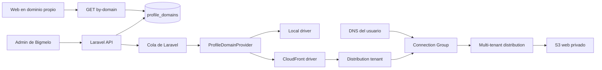

# Dominios personalizados de perfiles

## Resultado funcional

Cada perfil puede conectar un dominio o subdominio propio, por ejemplo `perfil.empresa.com` o `empresa.com`. Cuando la configuración termina, visitar `https://perfil.empresa.com` abre directamente el mismo perfil público que hoy está disponible en `https://bigmelo.com/alias`.

La URL original de Bigmelo continúa funcionando. El dominio personalizado no cambia el alias, el perfil, sus chats ni sus datos.

Solo se admite un dominio personalizado por perfil y un mismo dominio no puede asignarse a dos perfiles.

### Control desde Nuevas funcionalidades

El catálogo global contiene `domains.custom`, agrupado como `domains` y marcado con `profile_configurable=false`. Un administrador puede activarlo o desactivarlo en **Dashboard > Nuevas funcionalidades > Dominios personalizados**.

- Activado: la pestaña **Dominio** aparece en Configuración y se aceptan nuevas configuraciones.
- Desactivado: la pestaña se oculta y `POST /api/profile/{profile}/domain` responde `403`.
- Los dominios que ya están activos continúan resolviendo por HTTPS cuando el flag se desactiva. Esto evita que una operación administrativa interrumpa sitios publicados.
- La verificación automática, la consulta del estado y la desconexión de configuraciones existentes permanecen disponibles en la API. Para gestionarlas desde el admin se debe reactivar temporalmente el flag.
- No se crea una fila de `profile_feature_settings` por perfil porque es una disponibilidad global, no una preferencia individual.

## Flujo para el usuario

1. Entrar en **Perfil > Configuración > Dominio**.
2. Escribir únicamente el hostname, sin `https://`, puerto, ruta o wildcard. Ejemplo: `perfil.empresa.com`.
3. Seleccionar **Configurar dominio**.
4. Copiar en el proveedor DNS el destino que muestra Bigmelo.
5. No cambiar los nameservers. Solo se agrega un registro en la zona DNS existente.
6. Seleccionar **Verificar configuración** o esperar la verificación automática.
7. El estado pasa por Preparando dominio, Esperando DNS, Generando certificado, Activando y Activo.
8. Cuando está Activo, **Abrir dominio** permite comprobar el perfil por HTTPS.

La propagación DNS y la emisión del certificado pueden tardar desde algunos minutos hasta 24 horas. Un dominio que ya sirve otro sitio puede tener una interrupción durante el cambio de DNS y la validación inicial.

### Ejemplo en GoDaddy

Para conectar `bigmelo.abeldev.com` cuando `abeldev.com` está administrado en GoDaddy:

1. Abrir **Mis productos**, seleccionar `abeldev.com`, entrar en **DNS** y después en **Administrar DNS**.
2. Seleccionar **Agregar nuevo registro** y elegir **CNAME**.
3. En **Nombre** escribir `bigmelo`. GoDaddy completa el dominio base y forma `bigmelo.abeldev.com`.
4. En **Valor** o **Datos** pegar exactamente el routing endpoint mostrado por Bigmelo, sin `http://`, `https://`, rutas ni espacios.
5. Mantener el TTL predeterminado o seleccionar una hora.
6. Eliminar solamente otro registro A, AAAA o CNAME que tenga exactamente el mismo nombre `bigmelo`. No eliminar MX, TXT ni registros de correo.
7. Guardar, esperar la propagación y seleccionar **Verificar configuración** en Bigmelo hasta que el estado sea **Activo**.

No se debe usar **Reenvío de dominio**, **Forwarding** ni enmascaramiento. Tampoco se cambian los nameservers. Bigmelo necesita un registro DNS real para validar el hostname, emitir el certificado HTTPS y renovarlo automáticamente.

GoDaddy no permite un CNAME tradicional en el dominio raíz representado por `@`. Para ese caso se recomienda usar un subdominio como `perfil.tudominio.com` o administrar el DNS en un proveedor que ofrezca ALIAS, ANAME o CNAME flattening.

### Registro DNS

La API devuelve un registro con estos campos:

| Campo | Uso |
| --- | --- |
| `name` | Dominio configurado por el usuario. |
| `type` | `CNAME_OR_ALIAS` porque el tipo exacto depende del proveedor DNS. |
| `value` | Routing endpoint del Connection Group de CloudFront. |
| `purpose` | En producción sirve para enrutar tráfico y validar el certificado administrado. |

Para un subdominio se crea normalmente un CNAME. Para un dominio raíz se requiere Route 53 ALIAS o una función equivalente del proveedor, como ALIAS, ANAME o CNAME flattening. No debe eliminarse un registro MX, TXT u otro registro existente.

Los dominios internacionales deben enviarse en formato ASCII/Punycode. No se aceptan IP, wildcards, dominios reservados ni `bigmelo.com` o sus subdominios.

### Desconexión

**Desconectar dominio** abre una confirmación. La API marca el registro como `disconnecting` y encola la limpieza. En CloudFront primero desactiva el distribution tenant, espera que la desactivación termine y después lo elimina. El job reintenta mientras CloudFront completa la propagación.

Al terminar se elimina `profile_domains`. La URL `bigmelo.com/alias` no se modifica. El usuario debe retirar después el registro DNS de su proveedor. Si se elimina el perfil, la FK elimina el registro local; antes de borrar perfiles en producción se debe mantener el flujo de desconexión para no dejar un tenant huérfano en AWS.

## Arquitectura técnica



La distribución actual de `bigmelo.com` no se convierte ni se reemplaza. Los dominios personalizados usan una distribución CloudFront multi-tenant independiente en modo `tenant-only`. Esto limita el riesgo sobre el sitio principal y permite un distribution tenant por perfil.

### Base de datos

La migración `2026_08_13_000001_create_profile_domains_table.php` crea `profile_domains` con:

- `profile_id` único y FK con `cascadeOnDelete`.
- `hostname` único y normalizado en minúsculas.
- estado funcional, proveedor, ID y ARN del tenant.
- routing endpoint, ARN y estado del certificado, estado DNS y registros mostrados al usuario.
- último error seguro y fechas de solicitud, aprovisionamiento, verificación, activación y desconexión.

`Profile::domain()` es una relación `HasOne`.

### Estados

| Estado | Significado |
| --- | --- |
| `pending_provisioning` | El registro fue aceptado y el aprovisionamiento está en cola. |
| `pending_dns` | Existe el tenant y se espera el registro DNS correcto. |
| `pending_certificate` | DNS válido y certificado administrado aún no emitido. |
| `activating` | Certificado y DNS válidos; CloudFront está activando el tenant. |
| `active` | El dominio puede resolver el perfil público. |
| `failed` | Se agotaron los reintentos; el usuario puede volver a verificar. |
| `disconnecting` | Se está desactivando y eliminando el tenant. |

El endpoint público solo acepta `active`. También exige que el perfil esté `active` y `published`.

### Endpoints

| Método | Ruta | Ability | Resultado |
| --- | --- | --- | --- |
| `GET` | `/api/profile/{profile}/domain` | `profile:read` | Configuración o `domain: null`. |
| `POST` | `/api/profile/{profile}/domain` | `profile:write` | Crea la configuración y responde `202`. |
| `POST` | `/api/profile/{profile}/domain/verify` | `profile:write` | Encola verificación y responde `202`. |
| `DELETE` | `/api/profile/{profile}/domain` | `profile:write` | Encola desconexión y responde `202`. |
| `GET` | `/api/public/profiles/by-domain/{hostname}` | Pública y limitada | Devuelve únicamente un perfil visible con dominio activo. |

Los endpoints privados aplican la misma regla del resto de Configuración: propietario del perfil o rol admin. Se devuelve 404 al intentar acceder al perfil de otro usuario. La colección `postman/voitity-api.postman_collection.json` contiene la carpeta **Profile Domains** y la variable `profile_domain_hostname`.

### Cola y reintentos

- `ProvisionProfileDomain`: crea el tenant. Tiene 3 intentos y backoff de 30, 120 y 300 segundos.
- `RefreshProfileDomain`: consulta DNS, certificado y tenant; activa CloudFront cuando corresponde. Tiene 3 intentos.
- `DisconnectProfileDomain`: desactiva y después elimina; tiene 12 intentos porque CloudFront propaga cambios globales.
- Todos usan `WithoutOverlapping` por ID de dominio.
- El aprovisionamiento es idempotente: si CloudFront creó el tenant pero la respuesta se perdió, el reintento lo recupera por hostname únicamente cuando coinciden distribución, Connection Group y `profileId`.
- `php artisan profile-domains:refresh` encola dominios transitorios cada cinco minutos.
- `php artisan profile-domains:refresh --active` revisa dominios activos cada hora para detectar cambios externos.
- Un fallo temporal en la revisión horaria no cambia un dominio `active` a `failed`; conserva el tráfico y registra una alerta para el siguiente reintento.
- Un fallo permanente durante la desconexión queda identificado como `disconnect` y no participa en la verificación automática, evitando que el tenant vuelva a activarse.

En producción deben estar ejecutándose `queue:work` y `schedule:work`, igual que para embeddings y fuentes. Después de un deploy se deben reiniciar los procesos de larga duración para que carguen el nuevo código.

### Proveedores

`ProfileDomainManager` selecciona un `ProfileDomainProvider`.

#### Local

`PROFILE_DOMAIN_DRIVER=local` no llama AWS. Configurar genera el registro simulado y deja `pending_dns`; Verificar cambia a `active`. Esto permite probar API, UI y resolución por Host.

Para una prueba completa local:

1. Crear el dominio desde el admin.
2. Seleccionar Verificar.
3. Usar un hostname que resuelva a loopback, por ejemplo `perfil.127.0.0.1.nip.io`, o agregar un dominio controlado a `/etc/hosts`.
4. Visitar `http://perfil.127.0.0.1.nip.io:3001`. Vite ya permite hosts bajo `.nip.io` y `.localdev.me` en `vite.config.ts`.
5. La web consulta `/api/public/profiles/by-domain/perfil.127.0.0.1.nip.io`.

`.localhost`, `.local`, `.test`, `.invalid`, `.example` y `.internal` no son aceptados por la API. Para pruebas se usa un dominio controlado o un hostname de desarrollo resolvible como `localdev.me`.

`PROFILE_DOMAIN_LOCAL_PUBLIC_URL_PATTERN` controla el enlace mostrado por el admin local. Su valor por defecto es `http://{hostname}:3001`; `{hostname}` se reemplaza por el dominio configurado.

#### CloudFront

`PROFILE_DOMAIN_DRIVER=cloudfront` usa el AWS SDK para PHP y las credenciales del IAM role de la instancia, no claves estáticas.

Al aprovisionar:

1. Ejecuta `CreateDistributionTenant` con el ID de la distribución multi-tenant y del Connection Group.
2. Envía el dominio, el parámetro `profileId`, etiquetas de auditoría, `Enabled=false` y una solicitud de certificado administrado con `ValidationTokenHost=cloudfront`.
3. Lee `RoutingEndpoint` del Connection Group y lo devuelve como destino DNS.

Al verificar:

1. Ejecuta `GetDistributionTenant`.
2. Ejecuta `GetManagedCertificateDetails`.
3. Ejecuta `VerifyDnsConfiguration` para el hostname.
4. Cuando DNS es `valid-configuration` y el certificado está `issued`, ejecuta `UpdateDistributionTenant` con ETag y `Enabled=true`.
5. Solo marca `active` cuando el tenant está habilitado y su estado de proveedor es `deployed` o `active`.

Al desconectar obtiene el ETag actual, desactiva el tenant si corresponde y solo intenta `DeleteDistributionTenant` cuando ya está deshabilitado.

### Web pública

La web distingue los hosts de Bigmelo y desarrollo de un host personalizado:

- `bigmelo.com`, sus subdominios y localhost conservan el enrutamiento por alias.
- Otro hostname carga `Profile` usando `fetchProfileByDomain(hostname)`.
- El historial local del chat y la confirmación de contenido adulto se aíslan usando el hostname como clave.
- El canonical URL y el JSON-LD usan `https://dominio/`, no `bigmelo.com/alias`.
- Google Analytics conserva el consentimiento por host y funciona en hosts HTTPS de producción.
- El endpoint público no usa cookies. La configuración CORS actual de Laravel permite `api/*` desde cualquier origen con `supports_credentials=false`.

La CloudFront Function `infra/cloudfront/viewer-request.js` conserva los assets con extensión. Para rutas sin extensión de un dominio personalizado reescribe a `/index.html`; para Bigmelo mantiene las rutas estáticas por alias.

## Infraestructura AWS

`voitity-web/infra/cloudfront/custom-profile-domains.yml` crea:

- bucket privado y retenido para logs de acceso de CloudFront, con cifrado y expiración a 90 días.
- Origin Access Control para el bucket web privado.
- distribución CloudFront `tenant-only` con HTTPS redirect, HTTP/2 y HTTP/3, IPv6, función viewer-request, política de cache y política de headers.
- `index.html` como documento raíz para que `/` funcione igual que las rutas internas del perfil.
- Connection Group habilitado.
- políticas inline para que el rol EC2 de la API gestione tenants y el rol de GitHub invalide la distribución durante despliegues web.
- outputs para ID de distribución, ID y routing endpoint del Connection Group, OAC y ARN de la distribución.

Los IDs de políticas se reciben como parámetros. No están codificados en el template. AWS WAF se conecta opcionalmente mediante `WebAclArn`.

No se crean distribution tenants en CloudFormation porque son recursos de ciclo de vida del usuario. La API los crea y elimina en tiempo de ejecución.

### Política del bucket S3

El stack usa el bucket web existente. Su bucket policy debe permitir al nuevo ARN de distribución leer objetos con el nuevo OAC. Debe agregarse una segunda sentencia equivalente a esta, sin reemplazar la autorización de la distribución principal:

```json
{
  "Sid": "AllowCloudFrontProfileDomainDistribution",
  "Effect": "Allow",
  "Principal": { "Service": "cloudfront.amazonaws.com" },
  "Action": "s3:GetObject",
  "Resource": "arn:aws:s3:::WEB_BUCKET/*",
  "Condition": {
    "StringEquals": {
      "AWS:SourceArn": "DISTRIBUTION_ARN_OUTPUT",
      "AWS:SourceAccount": "AWS_ACCOUNT_ID"
    }
  }
}
```

### Permisos del rol de la API

El IAM role del servicio API necesita estas acciones CloudFront. Se deben limitar al account, distribución, Connection Group y tenants de Bigmelo cuando cada acción admita resource-level permissions:

```json
{
  "Version": "2012-10-17",
  "Statement": [
    {
      "Effect": "Allow",
      "Action": [
        "cloudfront:CreateDistributionTenant",
        "cloudfront:GetDistributionTenant",
        "cloudfront:GetDistributionTenantByDomain",
        "cloudfront:UpdateDistributionTenant",
        "cloudfront:DeleteDistributionTenant",
        "cloudfront:GetManagedCertificateDetails",
        "cloudfront:VerifyDnsConfiguration",
        "cloudfront:GetConnectionGroup",
        "cloudfront:TagResource"
      ],
      "Resource": "*"
    },
    {
      "Effect": "Allow",
      "Action": "acm:RequestCertificate",
      "Resource": "*",
      "Condition": {
        "StringEquals": {
          "aws:RequestedRegion": "us-east-1"
        }
      }
    },
    {
      "Effect": "Allow",
      "Action": "acm:DescribeCertificate",
      "Resource": "arn:aws:acm:us-east-1:AWS_ACCOUNT_ID:certificate/*",
      "Condition": {
        "StringEquals": {
          "aws:RequestedRegion": "us-east-1"
        }
      }
    }
  ]
}
```

Antes de producción se debe usar IAM Access Analyzer para reducir `Resource: "*"` donde CloudFront lo soporte. La API no necesita `AWS_ACCESS_KEY_ID` ni `AWS_SECRET_ACCESS_KEY` si corre con instance role.

`acm:RequestCertificate` y `acm:DescribeCertificate` son acciones dependientes cuando `CreateDistributionTenant` incluye `ManagedCertificateRequest`: CloudFront llama a ACM en nombre del role que crea el tenant. En infraestructura se limitan a `us-east-1`, que es la región obligatoria para certificados de CloudFront; `DescribeCertificate` se limita además a certificados de la cuenta. No se requieren llamadas ACM directas desde el código de la aplicación.

### Variables de producción

```dotenv
PROFILE_DOMAIN_DRIVER=cloudfront
PROFILE_DOMAIN_AWS_REGION=us-east-1
PROFILE_DOMAIN_CLOUDFRONT_DISTRIBUTION_ID=<output DistributionId>
PROFILE_DOMAIN_CLOUDFRONT_CONNECTION_GROUP_ID=<output ConnectionGroupId>
PROFILE_DOMAIN_CLOUDFRONT_ROUTING_ENDPOINT=<output RoutingEndpoint opcional>
PROFILE_DOMAIN_VALIDATION_TOKEN_HOST=cloudfront
```

El routing endpoint es opcional: si falta, el driver lo consulta con `GetConnectionGroup`. No contiene secretos. Todos los procesos API, worker y scheduler deben recibir las mismas variables.

En producción estos identificadores no secretos se guardan como variables de repositorio de GitHub:

| Repositorio | Variable |
| --- | --- |
| `voitity-api` | `PROFILE_DOMAIN_DISTRIBUTION_ID` |
| `voitity-api` | `PROFILE_DOMAIN_CONNECTION_GROUP_ID` |
| `voitity-api` | `PROFILE_DOMAIN_ROUTING_ENDPOINT` |
| `voitity-web` | `PROFILE_DOMAIN_DISTRIBUTION_ID` |

El workflow de API descarga primero el entorno base desde Secrets Manager y después reemplaza únicamente las líneas `PROFILE_DOMAIN_*` con estas variables. Así no se muestran ni se reescriben secretos y app, queue y scheduler reciben la misma configuración desde el `.env` desplegado. El workflow web invalida la distribución principal y enumera los tenants asociados exclusivamente a la distribución multi-tenant de Bigmelo para invalidar cada uno con `CreateInvalidationForDistributionTenant`. Una distribución `tenant-only` no acepta `CreateInvalidation` directamente sobre el ID de su distribución base.

### Orden de despliegue

1. Desplegar la migración y el código con `PROFILE_DOMAIN_DRIVER=local` o sin exponer todavía la UI en producción.
2. Validar y desplegar `custom-profile-domains.yml` en `us-east-1`.
3. Agregar el ARN de la nueva distribución a la bucket policy S3.
4. Adjuntar los permisos CloudFront al IAM role de la API.
5. Configurar los outputs en el entorno de API y cambiar el driver a `cloudfront`.
6. Reiniciar app, queue worker y scheduler.
7. Desplegar admin y web, incluyendo la CloudFront Function actualizada.
8. Probar primero con un subdominio controlado, revisar HTTPS, chat, medios, SEO y desconexión.
9. Revisar los logs de acceso retenidos 90 días y activar AWS WAF según la política operativa del entorno.

## Logs y observabilidad

La aplicación registra eventos estructurados para:

- lectura, rechazo de autorización, configuración, verificación y desconexión desde el controller;
- resolución pública exitosa o no encontrada por hostname;
- inicio, final y fallo permanente de cada job;
- operación AWS fallida con código y tipo AWS, HTTP status, request ID, perfil, dominio y tenant.

No se registran credenciales ni respuestas AWS completas. El hostname se registra porque es el identificador operativo que soporte debe diagnosticar.

Eventos principales:

- `Profile domain settings retrieved.`
- `Public profile resolved by custom domain.` / `Public profile custom domain lookup did not resolve.`
- `Profile domain configuration queued.`
- `Profile domain provisioning started/completed/failed permanently.`
- `Profile domain manual verification queued.`
- `Profile domain verification started/completed/failed permanently.`
- `Profile domain disconnection queued/started/completed/failed permanently.`
- `Profile domain CloudFront request failed.`

En producción conviene crear métricas o alarmas para `failed`, tenants en estado transitorio por más de 24 horas y errores permanentes de desconexión.

## Costos

El dominio no genera embeddings ni llamadas de IA. El costo incremental corresponde principalmente a CloudFront, solicitudes, transferencia, certificado administrado según el modelo vigente de CloudFront y observabilidad opcional. El DNS continúa siendo responsabilidad del usuario salvo que Bigmelo lo administre en Route 53.

Comercialmente puede incluirse un dominio en planes superiores o cobrarse como add-on para cubrir soporte, automatización, monitoreo y consumo AWS. No se debe prometer una tarifa fija de AWS en la UI porque el precio y el tráfico cambian.

## Diagnóstico

### Permanece en Esperando DNS

- Confirmar que el hostname y el destino coinciden exactamente con la UI.
- Consultar DNS público, no solo el resolver local.
- Confirmar que el proveedor no aplica proxy, redirección web o CNAME masking.
- Para dominio raíz, confirmar ALIAS/ANAME/flattening.
- Revisar `VerifyDnsConfiguration` y el log con request ID.

### Permanece en Generando certificado

- Confirmar que el DNS ya apunta al routing endpoint.
- Revisar CAA del dominio y permitir que Amazon emita el certificado.
- Revisar `GetManagedCertificateDetails` por `validation-timed-out` o `failed`.

### CloudFront informa CNAMEAlreadyExists

Si el tenant coincide con la distribución, el Connection Group y el `profileId` de la solicitud, la API lo recupera como reintento idempotente. En cualquier otro caso, el dominio ya está asociado a otra distribución o tenant de CloudFront y debe retirarse de allí antes de reintentar. La API nunca toma control automático de un tenant ajeno.

### El dominio abre el sitio pero no el perfil

- Confirmar que `profile_domains.status=active`.
- Confirmar que el perfil esté activo y publicado.
- Consultar `/api/public/profiles/by-domain/{hostname}`.
- Confirmar que la CloudFront Function publicada contiene la rama para custom hosts.
- Revisar consola del navegador, CORS y `VITE_API_BASE_URL`.

### La desconexión falla

CloudFront exige desactivar antes de eliminar. El job reintenta hasta 12 veces. Revisar estado y ETag del tenant y los permisos `UpdateDistributionTenant` y `DeleteDistributionTenant`. Después de resolver la causa se debe seleccionar nuevamente **Desconectar dominio**; la verificación queda bloqueada para no reactivar accidentalmente el tenant.

## Verificación de la implementación

Pruebas reproducibles ejecutadas desde cada proyecto:

```bash
# API completa (el límite evita agotar memoria en la suite local de 874 casos)
cd voitity-api/src
php -d memory_limit=512M vendor/bin/phpunit

# Admin
cd voitity-admin/src
npm run typecheck
npx eslint src/components/dashboard/profiles/profile-domain-settings.tsx src/lib/profile-domain/api-client.ts src/pages/dashboard/profile-details/settings.tsx --max-warnings=0
npm run build

# Web
cd voitity-web/src
npm run build

# Infraestructura y Postman
cd voitity-web
aws cloudformation validate-template --template-body file://infra/cloudfront/custom-profile-domains.yml
node --check infra/cloudfront/viewer-request.js
cd ../voitity-api
jq empty postman/voitity-api.postman_collection.json
```

La prueba funcional local usa `perfil.127.0.0.1.nip.io`: configura desde el admin, espera `pending_dns`, verifica hasta `active`, consulta el endpoint público, confirma el `index.html` servido por la web y finalmente desconecta. No se conserva el registro de prueba.
